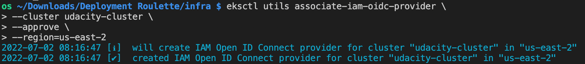
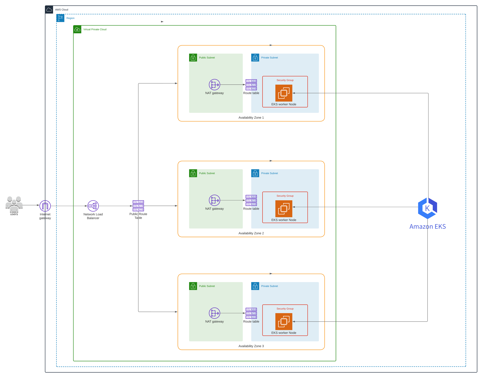

# Deployment Roulette

## Dependencies

- Udacity AWS Gateway
- [kubectl](https://kubernetes.io/docs/tasks/tools/)
- [awscli](https://aws.amazon.com/cli/)
- [eksctl](https://eksctl.io/introduction/#installation)
- [terraform](https://learn.hashicorp.com/tutorials/terraform/install-cli?in=terraform/aws-get-started)
- [helm](https://www.eksworkshop.com/beginner/060_helm/helm_intro/install/)

## Installation
The AWS environment will be built in the `us-east-2` region of AWS
1. Set up your AWS credentials from Udacity AWS Gateway locally
    - `https://docs.aws.amazon.com/cli/latest/userguide/cli-configure-files.html`
2. From the AWS console manually create an S3 bucket in `us-east-2` called `udacity-tf`
    - The click `create bucket`
    - Update `_config.tf` with your S3 bucket name
3. Deploy Terraform infrastructure
    - `cd starter/infra`
    - `terraform init`
    - `terraform apply`
5. Setup Kubernetes config so you can ping the EKS cluster
    - `aws eks --region us-east-2 update-kubeconfig --name udacity-cluster`
    - Change Kubernetes context to the new AWS cluster
        - `kubectl config use-context <cluster_name>`
            - e.g ` arn:aws:eks:us-east-2:139802095464:cluster/udacity-cluster`
    - Confirm with: `kubectl get pods --all-namespaces`
    - Change context to `udacity` namespace
        - `kubectl config set-context --current --namespace=udacity`
6. Run K8s initialization script
    - `./initialize_k8s.sh`
7. Done

### Project steps
1. Deployment Troubleshooting

   A previously deployed microservice `hello-world` doesn't seem to be reachable at its public endpoint.
    1. The `apps/hello-world` deployment is facing deployment issues.
        - Assessed, identified and resolved the problem with the deployment
        - Documented the findings via [deployment_troubleshooting.txt](apps/hello-world/deployment_troubleshooting.txt)

2. Canary deployments
    1. Created a shell script [canary.sh](apps/canary/canary.sh) that will be executed by GitHub actions.
    2. Canary deployed `/apps/canary-v2` so they take up 50% of the client requests
    3. Curled the service 10 times and saved the results to [canary.txt](apps/canary/canary.txt) to ensure that it is able to return results for both services
    4. Saved the output of `kubectl get pods --all-namespaces` to to [canary2.txt](apps/canary/canary2.txt)


3. Blue-green deployments

   The product teams want a blue-green deployment for the `green` version of the `/apps/blue-green` microservice because
   they heard it's even safer than canary deployments
    1. Created [green.yml](apps/blue-green/green.yml)
    2. Created a shell script [blue-green.sh](apps/blue-green/blue-green.sh) that executes a `green` deployment for the service `apps/blue-green`
    3. The bash script will wait for the new deployment to successfully roll out and the service to be reachable.
    4. Created a new weighted CNAME record `blue-green.udacityproject` in Route53 for the green environment by introducing `green.tf` and executed `terraform apply`
    5. Used the `curl ec2 instance` to curl the `blue-green.udacityproject` url and document that green & blue services are reachable
    
    6. Simulated a failover event to the `green` environment by removing aws_route53_record for the blue service through `dns.tf` and executing `terraform apply`
    7. Ensured the `blue-green.udacityproject` record now only returns the green environment
    

4. Node elasticity

   A microservice `bloaty-mcface` must be deployed for compliance reasons before the company can continue business.
    1. Deployed `apps/bloatware` microservice
    2. The application deployment was unsuccessful 
        1. The reason was unavailable nodes.
        
        2. One of resolutions was through increasing the number of EKS worker nodes.
        
        
        3. A different fix was to reverse the change on the number of nodes and implement autoscaling.
        
        
        
        
        
        
    3. The output of `kubectl get pods --all-namespaces` to show deployed services
    

5. Observability with metrics
    1. Installed a metrics server on the kubernetes cluster and identify the service using up the most memory
        - The output of the metrics command
        
        - Service using the most memory is hello-world. The result is stored in [high_memory.txt](apps/metrics/high_memory.txt).
    2. Deleted the service with the most memory usage from the cluster
        - The output of the metrics command
        

6. Diagramming the cloud landscape


## Project Clean Up

Clean up the environment with the `nuke_everything.sh` script or run the steps individually.

```
cd starter/infra
terraform state rm kubernetes_namespace.udacity && terraform state rm kubernetes_service.blue
eksctl delete iamserviceaccount --name cluster-autoscaler --namespace kube-system --cluster udacity-cluster --region us-east-2
kubectl delete all --all -n udacity
terraform destroy
```
